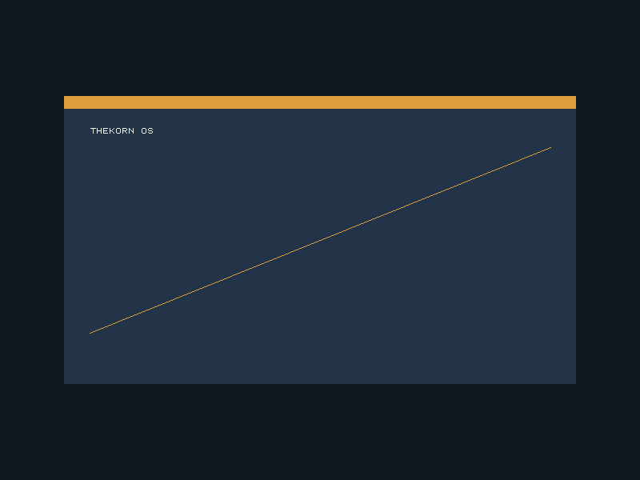

# thekorn-os



`thekorn-os` is a small AArch64 learning operating system written in Zig. The
project is developed QEMU-first and shares the same platform-neutral kernel
with the Raspberry Pi 4 (BCM2711) port.

The current implementation boots a freestanding kernel in writable QEMU
`virt` RAM at `0x40080000` and produces a separately linked, flashable
Raspberry Pi 4 image whose kernel loads at `0x80000`. Both targets enter EL1h,
install a complete AArch64 exception vector table, initialize their platform's
PL011 UART, and report boot and exception facts over serial. Both platform
implementations configure a GICv2-compatible interrupt controller and the Arm
generic physical timer; the complete Pi path is verified on physical hardware.
See the [v0 implementation plan](docs/plan.html) for the completed baseline and
the [v1 plan](docs/v1-plan.html) for the active interactive-system roadmap.
Both targets consume the firmware-provided device tree to discover RAM and
reserved ranges and initialize a 4 KiB bitmap physical-frame allocator.
The complete image is verified on a physical Pi 4 through the deliberate
exception return and final `BOOT:OK` marker. It builds a sparse
four-level identity map, enables the EL1 MMU and caches, then moves the kernel,
stack, and exception vectors into a protected `TTBR1_EL1` high-half mapping.
The low kernel alias is removed while device mappings remain available through
the active `TTBR0_EL1` root. QEMU and physical Pi 4 runs verify this transition,
page-granular W^X permissions, and the complete hardware gate.

The Phase 9 QEMU gate first loads two AArch64 ELF programs from a deterministic
embedded `newc` initramfs, then reloads them from a deterministic 4 MiB FAT16
image through a polling virtio-mmio block device. The kernel verifies that both
sources contain identical programs before starting three tasks on separate
kernel stacks. After the cooperative round-robin checkpoint, task 0 remains an
EL1 progress witness while tasks 1 and 2 become independently mapped Zig EL0
processes. Their ELF images use identical entry, data, heap, and stack virtual
addresses backed by separate memory and `TTBR0_EL1` roots. Each process uses
the versioned project ABI for `write`, `yield`, `exit`, and bounded memory
growth and is preempted during the same 1,000-tick timer run.

## Requirements

- Nix with flakes enabled
- A platform supported by `flake.nix` (`aarch64-darwin`, `aarch64-linux`, or
  `x86_64-linux`)

The Nix flake supplies the pinned compiler and host tools on
`aarch64-darwin`, `aarch64-linux`, and `x86_64-linux`. Zig fetches packaged
project inputs from `build.zig.zon` into `zig-pkg/`; the Pi image build also
downloads the matching board DTB from the pinned firmware tag and verifies its
SHA-256 digest before use.

## Build

```sh
nix develop --command zig build
```

The default build uses `ReleaseSmall` code generation while retaining symbols
and debug information in the ELF. It creates:

- `zig-out/bin/thekorn_os` — symbol-rich QEMU `virt` ELF linked at `0x40080000`
- `zig-out/users-fat16.img` — deterministic, read-only FAT16 image containing
  both Zig user programs for the QEMU virtio block device and Pi card image
- `zig-out/kernel8.img` — raw Raspberry Pi 4 kernel linked at `0x80000`
- `zig-out/thekorn-os-rpi4.img` — 64 MiB Pi-ready SD-card image with an MBR,
  FAT32 boot partition, read-only FAT16 user partition, the pinned Raspberry
  Pi firmware release, and the Pi kernel and BCM2711 device tree

Write `zig-out/thekorn-os-rpi4.img` to a spare microSD card from the command
line with:

```sh
nix develop --command bash scripts/flash-rpi4-sd.sh DEVICE
```

Use the whole removable disk as `DEVICE`, not one of its partitions. On macOS,
find it with `diskutil list` and use a name such as `/dev/disk4`. On Linux, use
`lsblk -p` and a name such as `/dev/sdb`. Check the device name and size
carefully: writing the image destroys all existing data on the selected card.
The script refuses internal fixed disks, non-removable media, and partition
devices, displays the selected disk, requires an exact interactive
confirmation, unmounts it, writes the image with `dd`, and safely ejects it. On
Linux it also verifies the written bytes; macOS automatically mounts and
modifies newly written FAT metadata, so an exact post-write comparison is not
possible there. It prompts for `sudo` only after confirmation. An alternate
image can be supplied as the second argument.

Raspberry Pi Imager remains an alternative: select the generated image with
its **Use custom** action. The build itself never selects or writes a device.
Connect a 3.3 V serial adapter to GPIO 14/15 at 115200 8N1 before powering the
Pi. See the [Pi 4 hardware guide](docs/rpi4.html) for wiring and recovery steps.

Every push to `main` runs the spell check, linter, host-runnable smoke tests,
and unit tests on Linux before building the Raspberry Pi 4 image. The
successful workflow run exposes `thekorn-os-rpi4.img` as a downloadable GitHub
Actions artifact named with the commit SHA.

An optimization mode can be selected explicitly, for example:

```sh
nix develop --command zig build -Doptimize=ReleaseSmall
```

## Run and verify

Lint the Zig source:

```sh
nix develop --command zig build lint
```

Run the kernel interactively on QEMU `virt`:

```sh
nix develop --command zig build run-virt
```

The normal build now selects the v1 boot profile. It shares platform, memory,
and MMU initialization with v0, emits `V1:INIT`, and idles while the init path
is developed. The frozen v0 self-test remains available as a regression gate:

```sh
nix develop --command zig build smoke-v0
nix develop --command zig build smoke-v1
```

To show the serial output in the QEMU graphical virtual console instead, run:

```sh
nix develop --command zig build run-virt-gui
```

Switch to the serial console with Ctrl+Alt+2 (Ctrl+Option+2 on macOS).

Run the timeout-bounded serial smoke test:

```sh
nix develop --command zig build smoke-virt
```

`smoke-virt` is retained as an alias for `smoke-v0`.

Check the Pi image, DTB handoff, UART, memory discovery, and EMMC2 error path
on the QEMU `raspi4b` machine:

```sh
nix develop --command zig build smoke-raspi4b
```

QEMU 11 attaches its emulated SD card to the legacy Pi controller rather than
BCM2711 EMMC2. This smoke test therefore expects a clean `STORAGE:FAILED` after
the initramfs gate. This failure is intentional only under QEMU and does not
show that EMMC2 works or that the generated card image is invalid. Physical
hardware is the authoritative Pi storage gate. A physical EMMC2 initialization
failure also reports the driver error, last command, interrupt status, and
present state before `STORAGE:FAILED`.

After writing the generated image to a card and connecting a 3.3 V serial
adapter, validate the complete physical-hardware marker contract with:

```sh
nix develop --command bash scripts/smoke-rpi4-serial.sh /dev/ttyUSB0
```

Pass an optional transcript path and timeout in seconds as the second and third
arguments. The script configures `115200 8N1` and captures serial only; card
selection, flashing, and Pi power control remain manual.

Run host-native tests:

```sh
nix develop --command zig build test
```

Collect host-native test coverage with kcov:

```sh
nix develop --command zig build test -Dcoverage
```

The command prints overall and per-file coverage, including uncovered line
numbers, and writes an HTML report to `zig-out/coverage/index.html`. The Nix
shell provides kcov on Linux; on macOS, install it separately with
`brew install kcov`.

The custom test runner prints each test's status and duration, followed by a
summary and the five slowest tests. Set `TEST_VERBOSE=false` for compact output,
`TEST_FAIL_FIRST=true` to stop at the first failure, or `TEST_FILTER=<text>` to
run matching named tests. Tests named `tests:beforeAll` and `tests:afterAll` are
run as suite setup and teardown hooks.

The current QEMU checkpoint handles a deliberate `brk` through the EL1h
synchronous vector, reports ESR/ELR/SPSR/FAR, and resumes after the trapped
instruction. It disables FP/SIMD and proves an accidental floating-point
instruction traps visibly. Three tasks then make bounded progress on separate
16 KiB kernel stacks: first through 95 cooperative round-robin switches, then
through exactly 1,000 timer preemptions. Before enabling the MMU, the kernel
parses both ELF64 images from its embedded initramfs, discovers the modern QEMU
virtio-mmio block transport, and reads the same files through the read-only
FAT16/32 implementation. It emits `INITRAMFS:OK`, `VIRTIO_BLK:OK`, and `FAT:OK`
after validating this storage path. During the preemptive gate, both programs
run from the same virtual addresses, retain private data and heap identities,
preserve separate `SP_EL0` values across a yield, and receive timer preemption
while task 0 continues at EL1. Each process proves versioned syscall decoding,
checked user pointers, on-demand growth within a four-page heap window, clean
exit, and direct-access faults for UART and removed kernel mappings. The
checkpoint emits `PROCESS:ISOLATION_OK`, `USER:OK`, `SCHED:OK`, `PHASE9:OK`, and
`BOOT:OK` before QEMU is terminated by the smoke-test timeout.
Before exception testing, it parses the QEMU DTB, reserves firmware, DTB, and
kernel-owned memory, sweeps all allocatable frames, and emits `MEMORY:OK`.
It then enables a protected identity map, installs the kernel's high-half
`TTBR1_EL1` map, moves the PC, stack, and exception vectors high, and removes
the low kernel alias. It emits `MMU:OK` after observing the expected faults for
the removed alias, a text write, execution from rodata and data, and a write to
an unmapped address. The console, exception path, and timer continue through
the transition.

## Debug

Start QEMU paused with a GDB-compatible server on TCP port `1234`:

```sh
nix develop --command zig build debug-virt
```

Then connect an AArch64-capable debugger to `localhost:1234` and load
`zig-out/bin/thekorn_os`. The ELF retains symbols for `_start`, `kernelMain`,
and Zig source locations.

The first-graphics work has an opt-in QEMU profile. It builds a separate
graphics-enabled kernel, attaches a modern MMIO virtio-gpu device, renders the
800 × 600 boot scene, and presents it on scanout 0:

```sh
nix develop --command zig build run-virt-graphics
nix develop --command zig build smoke-virt-graphics
```

The smoke gate waits for the serial success marker, captures the scanout through
QMP, and verifies its dimensions and stable scene colors. The resulting PPM is
written to `zig-out/virt-graphics.ppm`. It then boots the same graphics kernel
without a GPU and requires `GRAPHICS:FAILED` followed by `BOOT:OK`. The existing
headless `run-virt` and `smoke-virt` profiles remain unchanged.

The existing Pi 4 kernel also requests an RGB 32-bit framebuffer from the
firmware property mailbox, renders through the same pitch-aware software
renderer, and reports `GRAPHICS:RPI4_OK` on success. Failure is non-fatal and
reported as `GRAPHICS:FAILED`. Physical Pi serial and HDMI evidence verify the
mailbox framebuffer, visible scene, and unchanged full boot through `BOOT:OK`.

## Project status

- V1.0: active — the frozen v0 self-test and the normal v1 init profile share
  platform, physical-memory, and high-half MMU initialization; `smoke-v0`
  preserves the complete baseline marker contract and `smoke-v1` requires the
  placeholder `V1:INIT` path
- V1.1: active — scheduler slots have explicit lifecycle states, fixed wait
  queues provide IRQ-masked wait/wake/cancel transitions, monotonic deadlines
  use wrap-safe comparisons, and an idle task executes `wfi` when every normal
  task is blocked

- Phase 0: complete — freestanding build, linker layout, boot assembly, ELF,
  raw image, QEMU run/debug steps
- Phase 1: complete — QEMU PL011 serial output, boot facts, panic marker, and
  automated smoke test
- Phase 2: complete — EL1 exception handling and the Raspberry Pi 4 GPIO/PL011
  image are verified on physical hardware
- Phase 3: complete — GICv2 routing, generic physical timer interrupts,
  monotonic tick accounting, and the 1,000-tick gate are verified on QEMU and
  physical Pi 4
- Phase 4: complete — DTB RAM/reservation discovery, 4 KiB bitmap frame
  allocation, host tests, and the allocation-sweep gate are verified on QEMU
  and physical Pi 4
- Phase 5: complete — the protected identity map, high-half `TTBR1_EL1`
  transition, low-alias removal, and W^X fault probes are verified on QEMU and
  physical Pi 4
- Phase 6: complete — three separate kernel stacks, cooperative yields,
  exception-return context switching, FP/SIMD trapping, and timer preemption
  are enforced by the QEMU and physical-hardware smoke gates
- Phase 7: complete — both processes enter EL0, use the versioned
  `write`/`yield`/`exit`/bounded-growth ABI, are timer-preempted, and cannot
  directly access UART or kernel memory on QEMU and Pi 4
- Phase 8: complete — two embedded Zig ELF processes run at identical
  virtual addresses with independent backing, `TTBR0_EL1` roots, user stacks,
  data, and bounded heaps on QEMU and Pi 4
- Phase 9: complete — deterministic initramfs and FAT16 images, polling block
  drivers, a read-only block-device contract, and host-tested FAT16/32 parsing
  feed the isolated two-process smoke gate on QEMU and Pi 4
- Phase 10: complete — the Pi 4 BSP configures the BCM2711 GIC-400 and Arm
  generic physical timer, reads its FAT16 user partition through a polling
  EMMC2 driver, and completes the preemptive two-process demo and full serial
  hardware gate through `BOOT:OK`
- Graphics G0: complete — the fixed 800 × 600 XRGB8888 scene/display contract,
  serial outcome markers, and opt-in QEMU virtio-gpu run profile are
  host-testable and verified by the later QEMU and Pi graphics gates
- Graphics G1: complete — the allocation-free software renderer clips pixels,
  rectangles, integer lines, and fixed 8 × 8 glyphs; tests cover padded pitch,
  empty and malformed surfaces, edge clipping, channel order, and the complete
  scene's deterministic hash
- Graphics G2: complete — modern virtio-MMIO discovery, feature negotiation,
  DMA queue setup, submission, notification, and bounded completion polling are
  shared by device drivers; synthetic queue tests cover descriptor reuse and
  the unchanged QEMU storage smoke gate protects the block path
- Graphics G3: complete — a separately compiled opt-in QEMU kernel initializes
  the DTB-discovered virtio-gpu 2D device with validated polling responses,
  retains one contiguous page-backed XRGB8888 resource, selects scanout 0, and
  transfers and flushes the shared boot scene; failures remain serial-visible
  and non-fatal
- Graphics G4: complete — the bounded QMP smoke gate requires a clean full boot,
  captures the actual QEMU scanout, and verifies 800 × 600 geometry plus stable
  background, panel, accent, and glyph colors before retaining the PPM
- Graphics G5: complete — the Pi 4 property mailbox requests physical and
  virtual geometry, RGB depth/order, a page-aligned allocation, and pitch;
  validated firmware results feed the shared renderer, physical serial emits
  `GRAPHICS:RPI4_OK`, and HDMI evidence confirms the visible scene
- Graphics G6: complete — absent displays fall back without hiding
  serial boot, malformed protocol data, unsupported formats, allocation limits,
  and arithmetic bounds are tested, and both headless and visible-pixel QEMU
  gates remain reproducible alongside the complete physical Pi evidence

The focused
[first graphical output plan](docs/graphics-plan.html) tracks the work toward a
shared software framebuffer, QEMU virtio-gpu output, and Raspberry Pi 4 HDMI
framebuffer parity while keeping serial diagnostics authoritative. Physical
hardware verification and board parity are complete.
